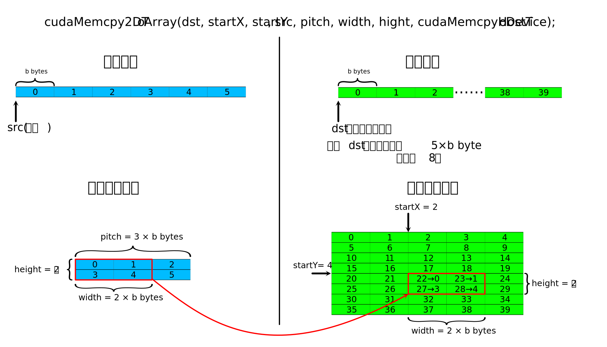

# CUDA高级优化技巧 {#cuda_adv}

这一章虽然称为高级优化技巧，其实不算什么高级内容，只是介绍一些有用的特性。

## 纹理和纹理内存
> _余忆童稚时，能张目对日，明察秋毫。见藐小微物，必细察其纹理，故时有物外之趣。——《浮生六记》_

### 什么是纹理？

在图形学中，纹理本来是一幅图像，用来被“贴”在要显示的位置。由于观察角度不同，显示的点到纹理上的点会有不同的映射关系。

从纹理中取得信息和从数组中取得值是类似的，但是从纹理中取值被称作“拾取”(fetch)，取到的内容称作“texel”。

但是和从数组中取值不同，拾取纹理可以使用非整数的下标，甚至可以自动进行插值。    

CUDA支持整数纹理和单精度浮点数纹理以及相应的2维或4维矢量纹理。（这里说的是纹理里面的值，相当于数组的类型是整数/单精度浮点数或者它们对应的矢量类型）。

### CUDA纹理的寻址模式和线性插值

CUDA的纹理支持“归一化”，即将坐标和/或值线性映射到零到一的区间里。

CUDA纹理支持整数拾取和浮点数拾取。同时对超过边界的拾取可设定为“环绕”(wrap)，“钳制”(clamp)，“镜像”（mirror）或者“边界”（border）。几种边界模式的不同如下（假设是1维的情况，纹理里的内容是(1, 2, 3, 4)，只列出从-4到7的“整数点”的值）

+ 环绕：(1, 2, 3, 4, 1, 2, 3, 4, 1, 2, 3, 4)    
+ 钳制：(1, 1, 1, 1, 1, 2, 3, 4, 4, 4, 4, 4)    
+ 镜像：(4, 3, 2, 1, 1, 2, 3, 4, 4, 3, 2, 1)    
+ 边界：(0, 0, 0, 0, 1, 2, 3, 4, 0, 0, 0, 0)

> 这里“整数点”加引号是由于纹素的坐标其实是有0.5的偏移的。用数组来举例：    
如果有数组a，a[0]=0, a[1]=1, a[2]=2, a[3]=3    
那么，同样的纹理t，t[0.5]=0, t[1.5]=1, t[2.5]=2, t[3,5]=3    
可以理解为类似把一个像素变成一个单位正方形，正方形的中心坐标和编号比起来是有0.5的偏移的。


注意，环绕和镜像模式只能在坐标“归一化”的的纹理中使用。

CUDA纹理支持两种过滤模式，“最近点”和“线性插值”。顾名思义，最近点取坐标最近的格点的值，而线性插值则是用相邻的格点的值进行线性插值来作为拾取到的值。这里，“最近点”用的是左闭右开区间，即t[0]=t[0.5]=t[0.99],t[1]=t[1.5]等等。

**注意！线性插值的精度是有限的。内部是用一个8bit的数做插值(我理解是把一个格子分成256份的意思)。所以如果对精度要求比较高，建议用最近点模式然后手动插值。如果对精度要求不是特别高的话，用线性插值模式可以获得更高的性能。**

**注意！纹理拾取函数接受的参数是单精度浮点数。如果坐标是双精度浮点数的话会自动转换成单精度。但是在最近点模式中，双精度转单精度并不是截断的，而是舍入到最近的单精度浮点，这意味着有可能因为进位而导致拾取到不同的值，这在手动插值的情况下会引发问题。建议手动转换至单精度或向下取整后传入参数。（建议使用`__double2float_rd(double)`手动向转换精度。这是由于向下取整得到的仍然是double，在传参时还是会经历一次精度转换，可能会有一定的性能损失。）**

### 举一个例子

其实是两个例子🌰，分别是一维（和二维差不多）和三维的单精度浮点数纹理的使用。其余情况大同小异。

#### 一维纹理的情况

```{c, eval=FALSE}
#include <stdio.h>
#include <stdlib.h>
#include <cuda_runtime.h>

__global__ void FetchFrom1DTexture(cudaTextureObject_t tex,
                                   float* position,
                                   float* result,
                                   unsigned int N){
    unsigned int id = blockIdx.x * blockDim.x + threadIdx.x;
    if(id < N){
        //拾取
        //<float>是c++模板
        //这里不详细解释模板了，总之在尖括号里填写纹理的类型就对了
        //第一个参数是一个texture object (cudaTextureObject_t)
        //第二个参数是要拾取的位置。
        result[id] = tex1D<float>(tex, position[id]);
    }
}

int main(){
    //我们要使用的纹理的原始值
    float* resource = (float*)(malloc(4*sizeof(float)));
    resource[0] = 1.0;
    resource[1] = 2.0;
    resource[2] = 3.0;
    resource[3] = 4.0;
    
    //创建一个CUDA Array
    
    //cudaChannelFormatDesc: 
    //  描述Array里每个元素的样子。这里每个元素是float。
    cudaChannelFormatDesc floatChannelDesc
                      = cudaCreateChannelDesc<float>();
    //声明CUDA Array
    cudaArray_t cuArray;
    
    //为cuarray分配空间。第三个参数是array在第一个维度上的长度。
    //这里长度单位是“个”，
    //因为在floatChannelDesc里已经描述了每个元素的大小了。
    //cudaMallocArray可以分配一维或二维的array
    //第四个参数用于指定第二个维度的长度（单位是多少行(háng)），默认为0
    cudaMallocArray(&cuArray, &floatChannelDesc, 4);
    
    //向CUDA Array中拷贝数据。
    //cudaMemcpy2DToArray用于向一维和二维Array中拷贝数据。
    //一维Array就是第二个维度长度为0的二维Array
    //第一个参数是目标CUDA Array
    //第二个参数是目标的x位置
    //第三个参数是目标的y位置
    //第二个参数和第三个参数的意义在于可以只更新Array的一部分
    //第四个参数是被拷贝的数据的指针
    //第五个参数是描述被拷贝的内容按照每一行多少byte来排列
    //第六个参数是目标位置每一行拷贝多少byte
    //第七个参数是一共拷贝多少行
    //第八个参数是拷贝方向，这里是从主机内存到显卡内存。原因前面讲过。
    //可以通过后文的图片详细了解这个函数的工作方式。
    cudaMemcpy2DToArray(cuArray, 0, 0,  resource, 4*sizeof(float),
                        4*sizeof(float), 1, cudaMemcpyHostToDevice);
    //其实拷贝完以后主机内存里的resource已经没用了，可以现在就free掉。
    
    
    //描述要成为纹理的东西是个啥
    //resType设置为cudaResourceTypeArray，表明要从一个Array来构建纹理
    //res.array.array设置成我们刚刚准备好的Array
    struct cudaResourceDesc resDesc;
    memset(&resDesc, 0, sizeof(resDesc));
    resDesc.resType = cudaResourceTypeArray;
    resDesc.res.array.array = cuArray;
    
    //描述我们要的纹理是个啥样子
    struct cudaTextureDesc texDesc;
    memset(&texDesc, 0, sizeof(texDesc));
    //addressMode可取的值有：
    //  cudaAddressModeWrap
    //  cudaAddressModeClamp
    //  cudaAddressModeMirror
    //  cudaAddressModeBorder
    //详情见上文描述
    //addressMode是长度为3的数组，分别对应三个维度。
    //这里是一维所以只用第一个。
    texDesc.addressMode[0]   = cudaAddressModeWrap;
    //filterMode可取的值有：
    //  cudaFilterModeLinear  线性插值模式
    //  cudaFilterModePoint   取最近点模式
    texDesc.filterMode       = cudaFilterModeLinear;
    //readMode可取的值有：
    //  cudaReadModeElementType  Array是什么类型拾取出来就是什么类型
    //  cudaReadModeNormalizedFloat  进行归一化
    //注意，只有8位或16位整数支持归一化，其他类型比如int/float则不支持。
    texDesc.readMode         = cudaReadModeElementType;
    //是否对坐标归一化到[0,1). 1表示进行归一化。
    texDesc.normalizedCoords = 1;
    
    //声明并创建纹理
    //这里相当于将纹理绑定到之前创建的cuArray
    //所以不能释放掉cuArray
    cudaTextureObject_t tex1DObj;
    cudaCreateTextureObject(&tex1DObj, &resDesc, &texDesc, NULL);
    
    //我们想要拾取的纹理的坐标。
    float* position = (float*)(malloc(60*sizeof(float)));
    for(int i = 0; i < 60; i++){
        position[i] = -1.0 + (float)(i)/20.0;
    }
    
    float* result = (float*)(malloc(60*sizeof(float)));
    
    float* cuposition;
    float* curesult;
    cudaMalloc(&cuposition, 60*sizeof(float));
    cudaMalloc(&curesult, 60*sizeof(float));
    cudaMemcpy(cuposition, position, 60*sizeof(float),
               cudaMemcpyHostToDevice);
    
    FetchFrom1DTexture<<<1, 60>>>(tex1DObj, cuposition, curesult, 60);
    
    cudaMemcpy(result, curesult, 60*sizeof(float),
               cudaMemcpyDeviceToHost);
    
    for(int i = 0; i < 60; i++){
        printf("Texel at position (%- 5.3f) is %5.3f \n",
               position[i], result[i]);
    }
    
    cudaFree(curesult);
    cudaFree(cuposition);
    
    free(result);
    free(position);
    free(resource);
    
    //不再使用的纹理要销毁掉
    cudaDestroyTextureObject(tex1DObj);
    //Array用完了也要释放
    cudaFreeArray(cuArray);
    
}

```

画图来表示一下结果的话

```{r echo=FALSE, message=FALSE, warning=FALSE, paged.print=FALSE}
require(ggplot2)
d<-data.frame(x=c(0:59)/20-1.0, y=c(2.500,1.902,1.305,1.102,1.301,1.500,1.699,1.898,2.102,2.301,2.500,2.699,2.898,3.102,3.301,3.500,3.699,3.898,3.695,3.098,2.500,1.902,1.305,1.102,1.301,1.500,1.699,1.898,2.102,2.301,2.500,2.699,2.898,3.102,3.301,3.500,3.699,3.898,3.695,3.098,2.500,1.902,1.305,1.102,1.301,1.500,1.699,1.898,2.102,2.301,2.500,2.699,2.898,3.102,3.301,3.500,3.699,3.898,3.695,3.098))

ggplot()+geom_path(data=data.frame(x=c(-1,c(1:12)/4-1/8-1,2)),y=c(2.5,1,2,3,4,1,2,3,4,1,2,3,4,2.5),aes(x=x,y=y),color='red')+geom_point(data=data.frame(x=c(1:4)/4-1/8),y=c(1,2,3,4),aes(x=x,y=y),color='red',size=3)+geom_point(data=d,aes(x=x,y=y))+xlab('position')+ylab('result')+ylim(0,5)
```

上图中红点是我们设定的值，由于设置了`texDesc.normalizedCoords = 1;`，[0,4)被映射到了[0,1)，相应的位置{0.5, 1.5, 2.5, 3.5}就被映射到了{1/8, 3/8, 5/8, 7/8}。由于设置了`texDesc.addressMode[0] = cudaAddressModeWrap;`，超过[0,1)范围的位置得到了从[0,1)平移过去的值。

```{r fig2, fig.cap='图解cudaMemcpy2DToArray', out.width='90%', echo=FALSE}

```

二维纹理与上述过程大同小异。

#### 三维纹理的情况

三维纹理则有所不同。在这个例子里面，我们使用float2作为纹理的类型。

```{c, eval=FALSE}
#include <stdio.h>
#include <stdlib.h>
#include <cuda_runtime.h>

__global__ void FetchFrom1DTexture(cudaTextureObject_t tex,
                                   float3* position,
                                   float2* result,
                                   unsigned int N){
    unsigned int id = blockIdx.x * blockDim.x + threadIdx.x;
    if(id < N){
        //拾取
        //tex3D的后三个参数分别为第一，第二和第三个维度上的坐标
        result[id] = tex3D<float2>(tex, position[id].x,
                                        position[id].y,
                                        position[id].z);
    }
}

int main(){
    //我们要使用的纹理的原始值
    float2* resource = (float2*)(malloc(8*sizeof(float2)));
    for(int i = 0; i < 8; i++){
        resource[i].x = 1.0 + (float)i;
        resource[i].y = -2.0 - 2.0 * (float)i;
        //顺便一提：
        //float2的两个分量是x和y
        //float3的三个分量是x，y和z
        //float4的四个分量是x，y，z和w
    }
    
    //创建一个CUDA Array
    //cudaChannelFormatDesc: 
    //  描述Array里每个元素的样子。这里每个元素是float2。
    cudaChannelFormatDesc floatChannelDesc
                       = cudaCreateChannelDesc<float2>();
    
    //cudaExtent是用来描述array的形状的
    //三个参数分别是宽(x)，高(y)，和深(z)
    cudaExtent ext = make_cudaExtent(2,2,2);
    //声明CUDA Array
    cudaArray_t cuArray;
    //为cuArray分配空间。
    cudaMalloc3DArray(&cuArray, &floatChannelDesc, ext);

    //由于三维拷贝参数比较复杂
    //所以CUDA设计了一个类型用于表达参数
    cudaMemcpy3DParms cpy3d={0};
    //纹理来源于resource数组
    cpy3d.srcPtr.ptr = resource;
    //来源数组中每两个float2算作一行
    cpy3d.srcPtr.pitch = 2*sizeof(float2);
    //来源数组每行取两个元素
    cpy3d.srcPtr.xsize = 2;
    //来源数组每两行组成一层
    cpy3d.srcPtr.ysize = 2;
    //拷贝的目的地是cuArray数组
    cpy3d.dstArray = cuArray;
    //目标里面在三个维度上各有几个元素，也是用cudaExtent
    //这里要复制到整个array，所以重用了前面定义的ext
    cpy3d.extent = ext;
    //从主机内存拷贝到显存
    cpy3d.kind = cudaMemcpyHostToDevice;
    //三维拷贝也可以像二维拷贝一样设置起点，这里就不详述了
    //可以参考cuda Toolkit 11.0.3的文档里
    //cuda runtime API中5.9节关于cudaMemcpy3D的说明
    cudaMemcpy3D(&cpy3d);
    

    struct cudaResourceDesc resDesc;
    memset(&resDesc, 0, sizeof(resDesc));
    resDesc.resType = cudaResourceTypeArray;
    resDesc.res.array.array = cuArray;
    
    struct cudaTextureDesc texDesc;
    memset(&texDesc, 0, sizeof(texDesc));
    //这回我们使用“边界”模式
    //因为是三维纹理，所以三个都要设置
    texDesc.addressMode[0]   = cudaAddressModeBorder;
    texDesc.addressMode[1]   = cudaAddressModeBorder;
    texDesc.addressMode[2]   = cudaAddressModeBorder;

    texDesc.filterMode       = cudaFilterModeLinear;
    texDesc.readMode         = cudaReadModeElementType;
    //这次不做归一化
    texDesc.normalizedCoords = 0;
    
    //声明并创建纹理
    cudaTextureObject_t tex3DObj;
    cudaCreateTextureObject(&tex3DObj, &resDesc, &texDesc, NULL);
    
    //我们想要拾取的纹理的坐标。
    float3* position = (float3*)(malloc(64*sizeof(float3)));
    for(int i = 0; i < 4; i++){
        for(int j = 0; j < 4; j++){
            for(int k = 0; k < 4; k++){
                int id = i + j*4 + k*16;
                position[id].x = (float)i - 0.5;
                position[id].y = (float)j - 0.5;
                position[id].z = (float)k - 0.5;
            }
        }
    }
    
    float2* result = (float2*)(malloc(64*sizeof(float2)));
    float3* cuposition;
    float2* curesult;
    cudaMalloc(&cuposition, 64*sizeof(float3));
    cudaMalloc(&curesult, 64*sizeof(float2));
    cudaMemcpy(cuposition, position, 64*sizeof(float3),
               cudaMemcpyHostToDevice);
    
    FetchFrom1DTexture<<<1, 64>>>(tex3DObj, cuposition, curesult, 64);
    
    cudaMemcpy(result, curesult, 64*sizeof(float2),
               cudaMemcpyDeviceToHost);
    for(int i = 0; i < 4; i++){
        for(int j = 0; j < 4; j++){
            for(int k = 0; k < 4; k++){
                int id = i + j*4 + k*16;
                printf("Texel at position (%- 5.3f, %- 5.3f, %- 5.3f)"
                       " is (%- 5.3f, %- 5.3f) \n",
                        position[id].x, position[id].y, position[id].z,
                        result[id].x, result[id].y);
            }
        }
    }
    cudaFree(curesult);
    cudaFree(cuposition);
    free(result);
    free(position);
    free(resource);
    cudaDestroyTextureObject(tex3DObj);
    cudaFreeArray(cuArray);
    
}

```

可以尝试取不同的位置看看拾取到的值是什么。

### 如何实现双精度纹理

CUDA不支持双精度纹理，但是可以用一个int2取去“骗”CUDA。    
用`cudaCreateChannelDesc<int2>()`生成int2的描述。    
取到纹理以后可以用`__hiloint2double`将两个int转化为double。    
但是注意，这里必须得将filterMode设置为`cudaFilterModePoint`，因为对两个uint插值再组合成double肯定和对double插值得到的结果不同。（详细原理可以参考附录中的浮点数的计算机表示方法）。

> 假设用`int2 texel = tex3D<int2>(texture, position);`拾取了texel    
要生成double需要`__hiloint2double(texel.y, texel.x)`    
这里先用y后用x似乎有点反直觉，但这其实是因为处理器是小端序的，因此要先写y

### 所以为什么要用纹理？

上面提到了使用纹理的诸多限制，而且还很麻烦。    
比如要使用double的话不能插值，还要额外进行转换。即便是可以插值的float，插值精度也不如手动插值，那是不是这些情况下使用纹理有什么意义呢？    
这涉及到缓存的原理。简单来讲，每次访问内存，如果要访问的内容没有被缓存，那么缓存会把要访问的内存和其附近的内存缓存起来，下次如果访问相邻的内存可以直接从缓存获取数据，减少访问内存的开销。而一般的缓存设计认为内存是线性的，但是在二维或者三维情况下，每次访问内存后，接着访问的很可能是逻辑上在空间中相邻的内存，这样就无法利用缓存进行高速读写。GPU中有专门的纹理缓存，具有空间局部性，会缓存在逻辑空间中临近的内容，而不再是线性内存的“附近”。

> CUDA的文档中提到纹理缓存具有二维的空间局部性，但是没有提到三维的情况。因此不能确定缓存在三维纹理的情况下是如何工作的。但即便是二维的局部性，也会比普通的一维缓存命中率高一些。


## 流

> _参差荇菜，左右流之。窈窕淑女，寤寐求之。——《诗经》_

之前的程序，我们都是CPU安置好数据以后把任务安排给GPU，然后就开始等，等到GPU运行完程序以后把数据拿回来。但是我们是不是可以把CPU也利用起来干点别的？可以的！    

这里要引入一个流的概念。我们可以创建一个流，然后把需要做的事情放进流里面，一个流里有任务的话就会自动开始工作。这时主机的工作只是把任务推到流里面，然后就可以做别的工作了。最后再让流和自己同步一下，保证流里的工作做完了即可。    

事实上，当不创建新的流的时候，是使用默认流来工作的，这个流是“阻塞”的，也就是说这个流里的任务完成之前会防止CPU进行下一步操作。而我们另外创建的流是“非阻塞”的，不会对CPU的工作流程造成影响。

### 举个例子

```{c, eval=FALSE}
#include <stdio.h>
#include <stdlib.h>
#include <time.h>
#include <cuda_runtime.h>

__global__ void muladd(double* a, double* b, double* c, double* d,
                       unsigned long long N){
    unsigned long long id = blockIdx.x * blockDim.x + threadIdx.x;
    unsigned long long j;
    if(id < N){
        for(j = 0; j < 1000000; j++){
            d[id] = a[id] * b[id] + c[id];
        }
    }
}

int main(){
    double* a; 
    double* b; 
    double* c; 
    double* d;

    double** cua;
    double** cub;
    double** cuc;
    double** cud;

    cudaMallocHost(&a, 8192*sizeof(double));
    cudaMallocHost(&b, 8192*sizeof(double));
    cudaMallocHost(&c, 8192*sizeof(double));
    cudaMallocHost(&d, 8192*sizeof(double));

    cua = (double**)(malloc(2*sizeof(double*)));
    cub = (double**)(malloc(2*sizeof(double*)));
    cuc = (double**)(malloc(2*sizeof(double*)));
    cud = (double**)(malloc(2*sizeof(double*)));

    unsigned long long i;
    for(i = 0; i < 8192; i++){
        a[i] = (double)(rand()%2000) / 200.0;
        b[i] = (double)(rand()%2000) / 200.0;
        c[i] = ((double)i)/10000.0;
    }
    
    //声明流
    cudaStream_t streams[2];
    //创建流，并分配一些显存空间。
    for(int i = 0; i < 2; i++){
        cudaStreamCreate(&streams[i]);
        cudaMalloc(&(cua[i]),1024*sizeof(double));
        cudaMalloc(&(cub[i]),1024*sizeof(double));
        cudaMalloc(&(cuc[i]),1024*sizeof(double));
        cudaMalloc(&(cud[i]),1024*sizeof(double));
    }

    for(int i = 0; i < 8; i++){
        cudaMemcpyAsync(cua[i%2], a+i*1024, 1024*sizeof(double),
                        cudaMemcpyHostToDevice, streams[i%2]);

        cudaMemcpyAsync(cub[i%2], b+i*1024, 1024*sizeof(double),
                        cudaMemcpyHostToDevice, streams[i%2]);

        cudaMemcpyAsync(cuc[i%2], c+i*1024, 1024*sizeof(double),
                        cudaMemcpyHostToDevice, streams[i%2]);

        muladd<<<16, 256, 0, streams[i%2]>>>(cua[i%2], cub[i%2],
                                             cuc[i%2], cud[i%2], 1024);

        cudaMemcpyAsync(d+i*1024, cud[i%2], 1024*sizeof(double),
                        cudaMemcpyDeviceToHost, streams[i%2]);
    }
    //CPU现在可以干点别的
    //......
    //搞完以后
    //和显卡同步一下，保证显卡上的每个流都执行完了里面的任务
    cudaDeviceSynchronize();

    for(i = 0; i < 8192; i++){
        if(i % 1001 == 0){
            printf("%5llu: %16.8f * %16.8f + %16.8f = %16.8f (%d)\n",
                    i, a[i], b[i], c[i], d[i], d[i]==a[i]*b[i]+c[i]);
        }
    }

    for(int i = 0; i < 2; i++){
        cudaFree(cua[i]);
        cudaFree(cub[i]);
        cudaFree(cuc[i]);
        cudaFree(cud[i]);
        //用完的流要销毁掉
        cudaStreamDestroy(streams[i]);
    }
    //cudaFreeHost 和 cudaMallocHost相对应

    free(cua);
    free(cub);
    free(cuc);
    free(cud);

    cudaFreeHost(a);
    cudaFreeHost(b);
    cudaFreeHost(c);
    cudaFreeHost(d);
}


```

上面的程序创建了两个流。为了方便管理，每个流使用的显存空间也是分开申请的。    

注意到程序里面分配主机内存空间的时候没有使用`malloc`而是使用了`cudaMallocHost`。这是因为非同步拷贝需要被拷贝的主机内容是“页锁定”的内存，而直接用`malloc`申请的空间不具备这种性质。

> 内存是分页的，具体讲起来比较复杂，大致来说就是程序中使用的地址是虚拟的，然后在经过一个虚拟地址到真实地址的映射来访问真实内存位置。而真实位置甚至可能是不连续的。而所谓“页锁定”内存是真实内存地址，不分页的。这样GPU从内存读取数据就不需要通过CPU查询页表，可以直接从内存取数据了。使用`cudaMallocHost`不仅使得使用流成为可能，还可以提高数据传输效率。    
但是要注意，不分页意味着即使内存占用过高的时候操作系统也不能将这部分内存放入交换空间。因此申请的页锁定内存过大可能会影响其他用户的体验。这些内存使用完后也请及时释放。


后面的`cudaMemcpyAsync`和`cudaMemcpy`是类似的，只不过要在最后一个参数里指定这个操作要被安排在哪一个流里面。

调用kernel的时候，`<<<...>>>`里面的参数变成了4个。前两个还不变，第三个表示要动态申请的共享内存的大小，由于这里不需要共享内存，填0即可。第四个参数是要使用的流。

> 共享内存是一种“片上内存”，和显存空间是独立的。共享内存空间比较小，但是速度比显存快。共享内存是分配给block的，也就是说每个block能看到自己的共享内存，但是互相是看不到的。一个block中的所有线程都可以看到这个block的共享内存，因此可以通过共享内存来通信。每一个块能拥有的共享内存大小可以查询（参考CUDA sample里的1_Utilities/deviceQuery）。

后面的`cudaDeviceSynchronize();`可以同步一块显卡上的所有流。它会等待直到所有流里的所有任务都完成后才返回，相当于让CPU等待GPU完成工作。如果想要只同步一个流，可以用`cudaStreamSynchronize`函数，传入一个`stream_t`变量即可同步对应的流。

一个流里的任务是按照推入任务顺序完成的，流之间如果不进行同步是不保证执行顺序的。

### 回调

除了可以向流里添加内存拷贝任务和执行kernel任务，还可以添加回调任务。

回调任务相当于一个运行在CPU上的函数，当回调任务前面的任务都结束后，会自动调用这个函数。

下面的代码定义一个回调函数

```{c, eval=FALSE}

void CUDART_CB my_callback(cudaStream_t stream,
                           cudaError_t status, void* data) {
    char* message = (char*)(data);
    printf("Callback!\n");
    printf("Message: %s\n", message);
}

```

其中的data是`void`型的指针，可以用来向回调函数传递信息。这里我们随便传递一个字符串。    

下面的代码将上面的回调函数添加到一个叫做`stream1`的流

```{c, eval=FALSE}
char* msg = "Encountering a callback!";
cudaStreamAddCallback(stream1, my_callback, (void*)msg, 0);
```

其中第四个参数是为未来的功能预留的，现在必须设为0.

第三个参数就是即将变成上面定义回调函数时设定的`void* data`的内容。

### 什么时候要使用流

当数据拷贝和数据处理用时差不多的时候使用流可以提高速度。这是因为进行计算的时候内存和显卡之间的带宽时闲置的。使用多个流可以在计算一部分数据的时候拷贝其他数据。

同时，由于PCIe总线是全双工的，主机到设备的拷贝和设备到主机的拷贝也是可以同时进行的。

如果拷贝上花的时间比计算时间长，也许要考虑包含拷贝时间的话这种计算是不是真的比CPU快了。（其实拷贝还蛮快的）

如果是计算密集型的，拷贝时间可以忽略不计的话不建议使用非默认的流（除非希望在CPU上同时进行其他工作）。

此外，永远不建议将数据分为非常多的小块。因为拷贝数据的带宽虽然很宽，但是有一定的延迟。分太多的块的话延迟时间累积起来也不可小觑。

## 缓存和共享内存的分配

共享内存是似乎是直接放在高速缓存中的。cuda允许调整共享内存和L1高速缓存的比例。

通过`cudaFuncSetCacheConfig`函数可以调整。函数的第一个参数是一个kernel函数（也就是`__global__`函数），第二个参数可以是

+ cudaFuncCachePreferNone   使用默认值
+ cudaFuncCachePreferShared 更多的共享内存
+ cudaFuncCachePreferL1     更多的L1高速缓存
+ cudaFuncCachePreferEqual  平均分配

例如：

```{c, eval=F}
cudaFuncSetCacheConfig(my_kernel, cudaFuncCachePreferShared);
```

如果不使用共享内存的话，更多L1缓存可能会带来更高的缓存命中率，提高程序性能。

如果想要调整整个程序的共享内存/缓存的分配情况，可以使用`cudaDeviceSetCacheConfig`函数。该函数只接受一个参数，传入上面提到的四种分配方式的枚举值之一即可。

例如：

```{c, eval=F}
cudaDeviceSetCacheConfig(cudaFuncCachePreferL1);
```

## 本章小结 {#cuadv_sum}

这一章就到这里了。其他内容比如各种“局部内存”、“常量内存”和“共享内存”等内容，还有其他各种~~奇技淫巧~~技术我也没有使用过，这里就不谈了。诸君感兴趣可以自己找资料看一看。

**到了这一章，小朋友已经问不动问题了。**

诸君有疑问再讨论吧。有合适的问题可以在后续版本中更新上来。


