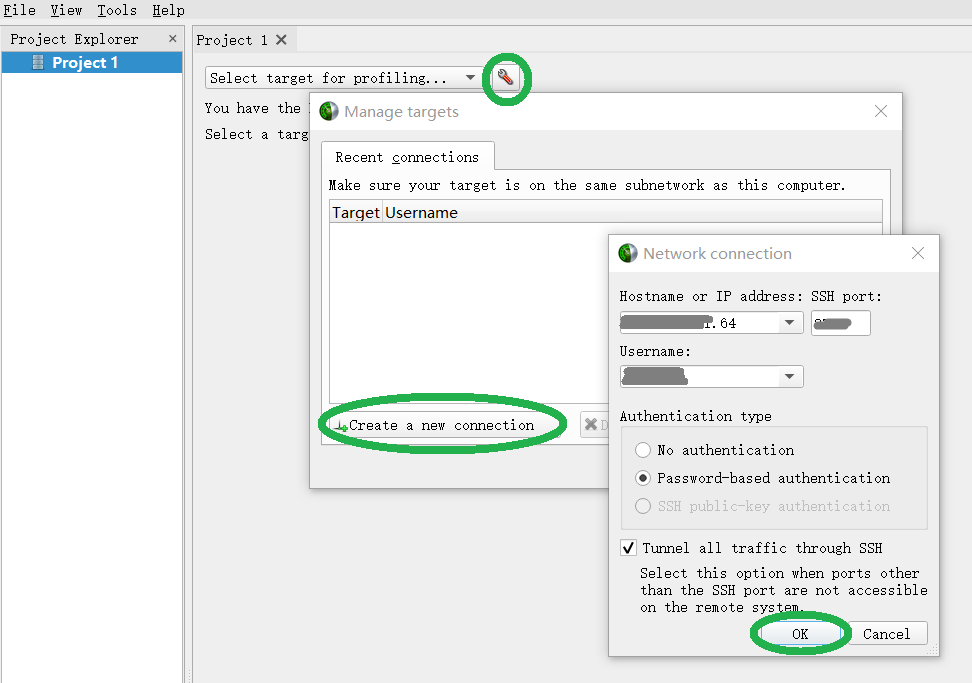
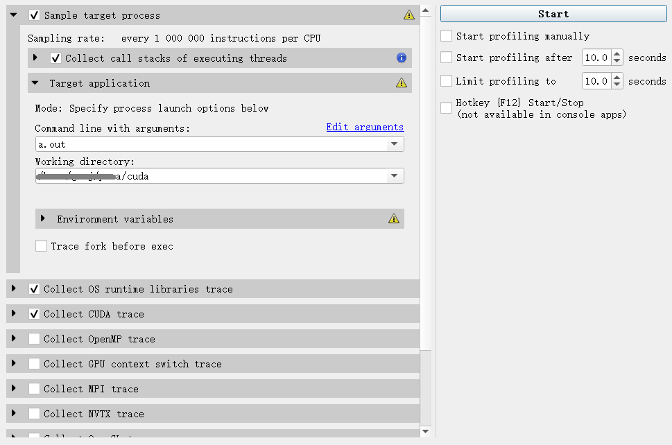
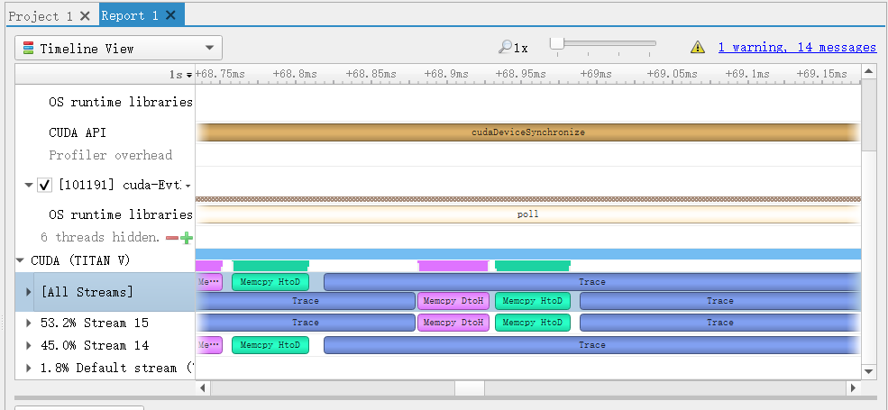

# 使用Nsight优化程序 {#nsight}

前文提到了使用流增加并行性，但是如何判比较据拷贝和计算分别占用的时长呢？这里隆重介绍一下Nsight。

Nsight可以对一个程序运行期间设备的行为进行采样，并在一个时间轴上画出来。这样就可以方便地分析数据传输延迟是不是产生了比较大的影响，计算和数据拷贝是不是可以更加高效地并行等等。

Nsight可以通过SSH连接到远程机器来监控程序运行情况，因此可以在本地安装Nsight来对服务器上的程序进行调试。

## 下载和安装

Nsight要安装到自己的计算机中，然后连接到服务器进并分析服务器上程序的行为。

在[这里](https://developer.nvidia.com/nsight-systems)下载nsight systems。下载后安装即可。

## 连接到服务器

如图，设置好服务器地址，ssh端口和用户名。点击connect即可连结。

```{r fig5, fig.cap='nsight', out.width='90%', echo=FALSE}

```


## 分析程序

如图，勾选要分析的部分，比如下面的"Collect CUDA trace".

然后在Working directory里面填上工作目录，在Command line with arguments里填上可执行文件和需要的参数。

在右边点击start即可开始分析。但是远程分析无法自动停止，因此需要估计好程序运行时间，然后点stop。

```{r fig6, fig.cap='nsight_prof', out.width='90%', echo=FALSE}

```


## 查看报告

停止以后，会出现一个“Report 1”标签页，里面有分析报告。上面可以看到时间轴，可以直观地看出各种调用占用的时间。

使用Ctrl+鼠标滚轮可以缩放时间轴。


```{r fig7, fig.cap='nsight_rep', out.width='90%', echo=FALSE}

```

## Nsight Compute

Nsight Compute可以更细致地分析CUDA程序的行为。用Nsight Compute远程连接到服务器似乎不太好操作，可以直接在服务器上使用Nsight Compute。

首先，需要使用"-Y"参数来连接服务器ssh。（"-Y"表示传输图形而不只是文字信息）

在服务器上，直接运行（前提是加载了`cuda`模块）

```{bash, eval=F}
nv-nsight-cu
```

即可打开界面。

Nsight Compute可以查看程序的缓存命中率，各种指令的使用情况，核心占用率等等信息。具体使用方法参见:

+ [Nvidia的Nsight Compute使用教程](https://docs.nvidia.com/nsight-compute/NsightCompute/index.html)
+ [Nvidia的Nsight Compute 命令行工具使用教程](https://docs.nvidia.com/nsight-compute/NsightComputeCli/index.html)

***此功能需要管理员权限。尝试了开启非管理员使用的选项，但似乎会导致系统不稳定。如果本地有CUDA环境请在本地使用Nsight Compute调试。如果需要在服务器上使用，请联系管理员。***

