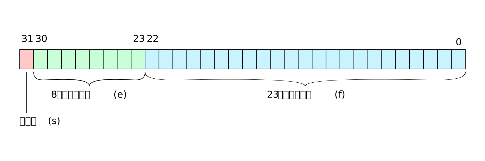
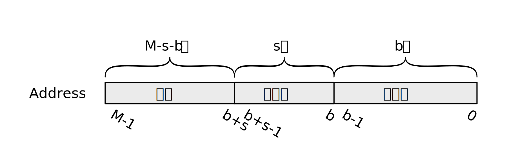

\cleardoublepage 

# (APPENDIX) 附录 {-}

# 汇编语言简介 {#assemble}

要讲汇编语言，就不得不提计算机是如何工作的。众所周知，计算机（硬件）是看不懂你写的程序的。需要用编译器或者解释器将程序变成计算机能看懂的二进制码才可以。

汇编语言其实是一种“助记符”。汇编语句和二进制机器码是一一对应的。相比于二进制机器码，汇编语言多少是可以读懂的。


## 基本操作

CPU会做些什么事呢？基本就是通过内存地址从内存里取几个字节到自己的寄存器里，然后对各个寄存器进行一番操作，什么加减乘除啊移位啊与或非啊什么的，然后还能把结果再存到内存里。

那么，条件判断呀调用函数呀是怎么实现的呢？条件判断是分为两步的，第一步做比较，然后一些特别的寄存器会根据比较结果设置为相应的值；第二步，根据一个或几个特别的寄存器里面的值是0或者1选择是否跳转到另一个位置。而跳转实际就是把指向当前指令的指针加或减一个合适的值，而这个指针的值其实也是保存在一个寄存器中的。函数调用呢，就是先把一些需要保护的寄存器内容暂存到内存里，然后在合适的寄存器或内存地址里设置好要传递的参数，并且把当前的指令指针保存到内存中，然后跳转到相应函数位置。函数执行完毕后再把返回值放到指定的寄存器或者内存位置，然后再把保存起来的指令指针恢复到寄存器里。关于哪些寄存器需要调用方保护，哪些需要被调用方保护，用哪些寄存器传递参数和返回值则取决于编程语言的调用约定。

汇编语言中的数值拷贝（从内存到寄存器，寄存器到寄存器，寄存器到内存，立即数到寄存器等等）被称作“mov”，虽然事实上并不是移动，“mov”完后原来位置的信息并不会被消掉。

> 立即数指的是直接有一个数字。从立即数到寄存器的“mov”相当于把寄存器设置成一个指定的值。

## 神奇的“装载有效地址”

有一条指令`lea`，是“load effective address”的缩写。这条指令本来是用于计算内存地址的，通过一个基地址，一个偏移量和每个元素的大小来计算出需要的地址。但是卑鄙的人类竟然动起了歪心思，用这条指令来做代数运算。

举个例子，比如要计算一个整数乘以5再加上3，汇编代码有可能是这样的

```{bash, eval=FALSE}
  lea 0x3(%rdi,%rdi,4), %rax
```

然后rax寄存器中的值就等于rdi寄存器的值乘上5然后再加三。

真正用于装载地址的时候，括号里面第一个值相当于基地址，第二个是偏移量，第三个是每一个偏移对应的字节数(只能是1,2,4,8)，括号前面的数字是以byte位单位的常数偏移量。

所有编译器就发现了这东西完全可以用于装载地址以外的用途。上面的例子中，计算了rdi+rdi*4+3，也就是我们想要的乘5加3.


## c语言中的内联汇编

**不同编译器里使用内联汇编的方法可能有微小的不同。这里是gcc的情况**

gcc中，内联汇编写在`__asm__`里面。如果在`__asm__`后加了`__volatile__`则表示要求编译器不要对这里面的汇编代码进行优化。

这里用前面第一部分的AVX汇编举例

```{c, eval=FALSE}
__asm__ __volatile__(
            "movq %0, %%rax \n\t"
            "movq %1, %%rbx \n\t"
            "movq %2, %%rcx \n\t"
            "movq %3, %%rdx \n\t"
            "movq %4, %%r8  \n\t"
            "shr  $2, %%r8  \n\t"
            "movq $0, %%r9  \n\t"
            "jmp  .check_%= \n\t"
            ".loop_%=:         \n\t"
            "shl $2, %%r9   \n\t"
            "leaq (%%rax, %%r9, 8), %%r10  \n\t"
            "vmovupd (%%r10), %%ymm0       \n\t"
            "leaq (%%rbx, %%r9, 8), %%r10  \n\t"
            "vmovupd (%%r10), %%ymm1       \n\t"
            "leaq (%%rcx, %%r9, 8), %%r10  \n\t"
            "vmovupd (%%r10), %%ymm2       \n\t"
            "vmulpd %%ymm0, %%ymm1, %%ymm3 \n\t"
            "vaddpd %%ymm2, %%ymm3, %%ymm3 \n\t"
            "leaq (%%rdx, %%r9, 8), %%r10  \n\t"
            "vmovupd %%ymm3, (%%r10)       \n\t"
            "shr $2, %%r9                  \n\t"
            "add $1, %%r9                  \n\t"
            ".check_%=:                    \n\t"
            "cmpq %%r8, %%r9               \n\t"
            "jl .loop_%=                   \n\t"
            :
            :"m"(a), "m"(b), "m"(c), "m"(d), "m"(N)
            :"%rax", "%rbx", "%rcx", "%rdx", "%r8", "%r9", "%r10",
             "%ymm0", "%ymm1", "%ymm2", "%ymm3", "memory"
            );
```

首先，每行写一句只是为了看起来方便。在c语言中，一个长的字符串是可以换行的，分到每一行后分别加引号，中间没有逗号就会当作一个长的字符串。

每一句后面加`\n\t`，否则多条汇编语句会在结果中连成一行，无法被汇编器读懂。

> 汇编代码一行一句，不用分号

`__asm__`的括号里首先要写的就是我们要执行的汇编代码之后用冒号隔开三个部分，分别是要写入的变量，要读取的变量和发生变动的寄存器。

变量前面引号里面"m"表示内存内容，用"r"则表示这个变量应该被放入寄存器（由编译器指定一个寄存器）。要写入的寄存器变量要写成"=r"。

后面寄存器列表里面，把汇编代码中用到的寄存器都新进来就对了。似乎改变了内存的话要写"memory"，但没有验证过，反正写了不会出问题。

在汇编代码里引用变量要用"%"，百分号后面的数字表示变量的编号（后面从写入变量到读取变量从0开始连续编号，数一数是第几个）。由于这里使用了百分号，使用寄存器就要多写一个百分号，比如"%eax"就要变成"%%eax".    

在寄存器外面加一个括号表示把这个寄存器中的值当作一个地址，要的是这个地址的内存里面的东西（除了装载有效地址的时候这个只是当作一个地址，不会实际访问内存）。

汇编代码中以冒号结尾的是一个标签，跳转的时候可以跳转到标签。最后编译好多二进制里是没有这个标签的，跳转会全部被翻译为跳转到相应的地址。在gcc的内联汇编里面，跳转标签要在后面加上`_%`。

在`cmpq %%r8, %%r9`这句，比较了r9寄存器和r8寄存器中的值，并相应地设置了特别的用于比较和跳转的寄存器。后面紧跟的一句`jl .loop_%`，是说如果判出来大于，就要跳转，否则不跳。

# 浮点数的计算机表示 {#float}

> _"The answer to the ultimate question of life, the universe and everything is 42."——The Hitchhiker's Guide to the Galaxy_

这里只对双精度，单精度和半精度浮点数进行说明，不涉及x87的80位扩展精度浮点数。这几种浮点数都是按照IEEE754标准里规定的方式进行存储的。

计算机表示浮点数，其实用的是科学计数法，惊不惊喜，意不意外？只不过是二进制的科学计数法。计算机中的一个浮点数包含三个部分，符号、指数和尾数。下面用单精度浮点数来说明这三个部分是怎么组合成一个32位实体的。

## 单精度浮点数

一个单精度浮点数在内存中大概是下面这个样子的（不考虑实际存储按照大段序或小端序。左边是高位，右边是低位）。


```{r fig3, fig.cap='单精度浮点数', out.width='90%', echo=FALSE}

```

所有的单精度浮点数分为三种，规格化的，非规格化的和特殊值。

### 规格化的单精度浮点数

大多数浮点数是规格化的。规格化的浮点数要求指数部分不为全零且不为全一。

符号位(s)表示浮点数的正负。0表示正数，1表示负数。

指数部分(e)表示一个有偏置的指数。非全零或全一的八位二进制可以表示从1到254，这里偏置是-127。所以指数部分的范围是-126到+127.

尾数部分(f)之所以称为“尾数”，是因为小数点前面的1并没有被表达在这一部分里面。根据科学计数法的定义，小数点前必须有且仅有一位，而且不是零。二进制中，这一位只能是1.于是我们通过这种方法相当于获得了额外的一位精度。

综上，规格化的浮点数表示的值可以写成

$$
 value = (-1)^s \times (1 + f \times 2^{-23}) \times 2^{e-127}
$$

或者
$$
  value = (-1)^s \times 1.f_{22}f_{21}\cdot\cdot\cdot f_{0} \times 2^{e-127}
$$

### 非规格化的单精度浮点数

指数位全部为0的时候浮点数称为非规格化的浮点数。这部分浮点数提供了0的表示方法。

这部分浮点数就不适用科学计数法了，表示方法类似于无符号整数。

$$
  value = (-1)^s \times f \times 2^{-149}
$$

或者

$$
  value = (-1)^s \times 0.f_{22}f_{21}\cdot\cdot\cdot f_{0} \times 2^{-126}
$$

指数固定为-126，这样就可以“无缝”地与规格化浮点数相连起来。当尾数部分全部为0地时候，这个浮点数就表示0.

在标准中，+0和-0是两个数，它们只在一些微小的地方略有不同，一般不用在意。

### 特殊值

指数位全部是1的浮点数表示特殊值，包括NAN (not a number)和正负无穷大。当尾数全部为0时，根据符号位，表示正无穷或负无穷。尾数不全为0的则表示NAN。当运算结果溢出的时候会得到正负无穷的结果，一些“无意义”的计算会导致NAN。

## 双精度浮点数和半精度浮点数

表示方法和单精度浮点数一致，只不过指数部分有11位(表示-1022到+1023)，尾数部分有52位。

半精度浮点数也是一样的，指数部分5位(表示-14到+15)，尾数部分只有10位。

# 高速缓存 {#cache}

在古代，是没有高速缓存的说法的，cpu直接和内存通信。后来cpu越来越快，内存却跟不上cpu的速度了，于是人们设计了高速缓存。高速缓存离cpu更近，也就有了比内存更快的速度，然而高速缓存比较昂贵，因此空间非常有限。

现代的cpu一般有多级缓存，一级缓存比二级缓存快但比二级缓存小，二级缓存比三级缓存快但比三级缓存小，这样。这里按照最简单和原始的情况，也就是只有一级缓存的情况来描述缓存的性质。

对于程序来说，缓存是“透明”的，也就是说程序是感受不到缓存的存在的，所有的内存访问看起来都像是直接访问了内存。这种特性使得编程变得很容易，但是如果要针对缓存使用进行优化则变得比较困难。

## 局部性原理

局部性原理有两种形式：时间局部性和空间局部性。

时间局部性：一个程序具有良好的时间局部性的话，被引用过一次的存储器位置很有可能在**不久**的将来再次被引用。

空间局部性：一个程序具有良好的空间局部性的话，被引用过一次的存储器位置**附近**的位置很有可能在不久的将来被引用。

具有良好局部性的程序可以最大程度地利用缓存的特性。局部性原理和高速缓存好像有点像鸡和蛋的关系。

## 缓存的组态

缓存是分成许多***组***的，每一组又包含一些***行***，每一个行有一个由若干字节组成的块。每个行里还包含一个标记。

假设我们的缓存一共有$S=2^s$组（组的数目一定是2的某次方），每个组有$E$行，每一行包含$B=2^b$字节（B也一定是2的某次方）。然后设计算机的所能给出的地址共M位（比如在32位系统里$M=32$），一条地址就按照下图分成三部分

```{r fig4, fig.cap='内存地址和缓存的对应', out.width='90%', echo=FALSE}

```

每次访问一个地址的时候，cpu会根据地址的组索引部分去找缓存中相应的组，然后讲标记部分和组里每一行的标记做对比，如果一致那么将直接读取缓存中的数据，避免访问内存。如果这一组所有的行的标记都与地址的标记不同，将会从这一组中消去一行，然后把目标内存缓存进来。（每次会缓存$2^b$字节。也就是这一组标志和索引对应的所有内存内容）。

注意到偏移量是$b$，而缓存的每一行中有$2^b$个字节，cpu会根据这个偏移量去缓存中找对应的字节。

关于缓存不命中的时候到底要消去缓存组中的哪一行，有各种不同的设计，比如随机消去一行，或者把最后一次使用时间最远的消去，或者把访问量最小的一行消去等等。


## 缓存优化

举个例子，在操作比较大的矩阵的时候，假设矩阵是按照行存储的（$address = col + row \times max\_col$），那么按照先行后列的方式访问可能会获得更快的速度。

在某些情况下，如果更加精细地设计一些，也许可以在每一行后面增加一些无意义的字节，来提高缓存命中的概率（比如需要交替访问多行，使得访问后面的行的时候不要消除前面行的缓存内容）。

## 如何查看cpu的缓存组态

+ 查看L1缓存有多少组：

```{bash, eval=F}
cat /sys/devices/system/cpu/cpu0/cache/index0/number_of_sets
```

上面`cpu0`表示第一个cpu，服务器上`/sys/devices/system/cpu/`下会有96个cpu。不要担心，它们的缓存参数是一致的。`index0`表示该cpu里面的第一个缓存。经实验，`index0`和`index1`是一级缓存，分别是数据和指令缓存；`index2`是二级缓存；`index3`是三级缓存。二级和三级缓存都是部分数据/指令的。


+ 查看每一组有多少行：

```{bash, eval=F}
cat /sys/devices/system/cpu/cpu0/cache/index0/ways_of_associativity
```

+ 查看每一行有多少字节：

```{bash, eval=F}
cat /sys/devices/system/cpu/cpu0/cache/index0/coherency_line_size
```

+ 查看缓存的大小

```{bash, eval=F}
cat /sys/devices/system/cpu/cpu0/cache/index0/size
```

其实也可以算出来。上面每一行字节数乘以每一组行数再乘以组数即可。

+ 其他信息也都在同意目录下，可以自行探索一下。


## 感受一下缓存不命中

还是请回我们的muladd程序。据查，我们的cpu的一级数据缓存每一行有64个字节。已知每个double占8个字节，也就是说我们的一行缓存最多可以缓存8个双精度浮点数（如果它们在内存里是对齐到8字节的话（一般来说的确是这么对齐的））。这回我们每次跳跃地进行计算，每次加8，来尝试使得缓存无法命中：

```{c, eval=F}
__attribute__ ((noinline))
void muladd(double* a, double* b, double* c, double* d,
            unsigned long long N){
    unsigned long long i,j;
    for(i = 0; i < 8; i++){
        for(j = i; j < N; j+=8){
            d[j] = a[j] * b[j] + c[j];
        }
    }
}
```

根据上一节的命令，我们查到CPU的一级缓存是32kB，也就是说最多可以存储4096个double，所以无论如何，这些数字是不可能全部缓存起来的。（这也是最开始为什么选择了8192作为数组维度）。


显然，这个函数也是一样对每组a[i]，b[i]，c[i]进行一次计算。编译并运行，可以发现原来耗时约20s的程序，现在需要30s。

二级缓存和三级缓存相对空间要大一些，而且是数据和指令共用的，一般就不对它们进行优化了（吧？）。


